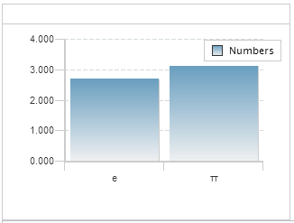
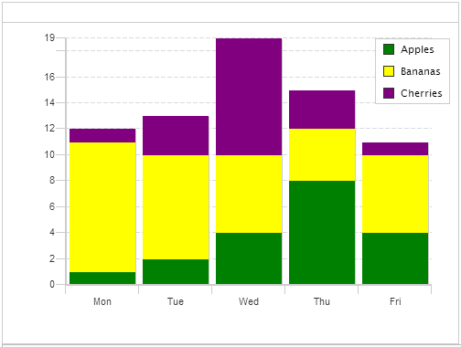
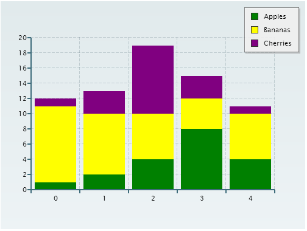

cfchart
===

The `<cfchart>` tag provides the ability to create charts in CFML. As a very minimal example:

**Listing 1 : min.cfm**

    <cfchart format="html">
	    <cfchartseries type="Bar" label="Numbers">
	         <cfchartdata item="e" value="2.71828">
            <cfchartdata item="&pi;" value="3.14159">
        </cfchartseries>
    </cfchart>

	
	
`<cfchart>` can implement charts as images in JPG or PNG format, as well as Flash, and - the focus of this chapter - JS/CSS/HTML. In versions of ColdFusion from 6.x to 9.x the chart engine was restricted to server-side-generated JPG/PNG/Flash-based charts; ColdFusion 10 added client-side charting capabilities.

For this chapter we will make use of the [ZingCharts](http://www.zingchart.com/) library, which is the same library ColdFusion uses. However we will simply use ZingCharts directly. Coincidentally the examples will also use jQuery to provide AJAX access to the data for the example, but this is just to demonstrate separation of model and view concerns, and is not a requirement of ZingCharts itself. Please note that only ColdFusion 10 *enterprise* includes licensing for ZingCharts; if one is not using that version, a separate licence will be required from ZingCharts. For unlicensed developmental purposes ZingCharts is fully-functional, but includes a watermark, which is removed once a licence is applied.

As a baseline, here is how one might implement a quick stacked bar chart with `<cfchart>`:

**Listing 2 : cfchart.cfm**
    
    <cfset records = new DAO().getDataForCfmlVersion()>
	<cfset seriesColours = ["Green","Yellow","Purple"]>
	<cfset seriesColour = 1>
	<cfchart chartwidth="1000" chartheight="750" seriesplacement="stacked" format="html">
		<cfloop query="records" group="item">
			<cfchartseries type="Bar" label="#item#" seriescolor="#seriesColours[seriesColour++]#">
				<cfloop>
					<cfchartdata item="#day#" value="#total#">
				</cfloop>
			</cfchartseries>
		</cfloop>
	</cfchart>

With the data returned from the DAO, this renders:

Now here is an analogous chart, totally written in simple HTML and JavaScript. 

**Listing 3 : zingChart.html**
    
    <!doctype html>
    <html>
        <head>
            
            
        </head>
        <body>
            

        </body>
        
    </html>

**Listing 4 : renderChart.js**
    
	$(document).ready(function(){
		$.getJSON(
			"DAO.cfc?method=getDataForJSVersion",
			function(data){
				applyLabels(data.records);
				zingchart.render(configureChartParams(data));	
			}
		);

		var applyLabels = function(records){
			seriesColours = ["Green","Yellow","Purple"];
			records.forEach(function(series, index){
				series["background-color"] = seriesColours[index];
			});
			return records;
		};

		var configureChartParams = function(data){
			return {
				id		: "myChartDiv",
				height	: 750,
				width	: 1000,
				data	: myChart = {
					type	: "bar",
					stacked	: true,
					series	: data.records,
					"scale-x"	: {
						values:data.label
					},
					legend		: {}
				}
			};	
		}

	});
	
	
As you can see, the only mark-up needed is the myChartDiv `
`. The rest is done with JavaScript. It might seem like the JavaScript is complicated, but it boils down to a call to `zingchart.render()`, passing it an object containing data and config. As I said above I am using AJAX here to fetch the raw data from the server, but that is not a requirement, it could just as easily be inline JavaScript. Here's the render:

The styling is not exactly the same, but that's due to ColdFusion using different "default" styling than ZingCharts does.

For completeness, here is the code for `DAO.cfc`:

**Listing 5 : DAO.cfc**

    component {

        remote struct function getDataForJSVersion() returnformat="json" {
            return {
                "labels"    = "Mon,Tue,Wed,Thu,Fri",
                "records"    = [
                    {
                        "text"    ="Apples",
                        "values"=[1,2,4,8,4]
                    },{
                        "text"    ="Bananas",
                        "values"=[10,8,6,4,6]
                    },{
                        "text"    ="Cherries",
                        "values"=[1,3,9,3,1]
                    }
                ]
            };
        }

        public query function getDataForCfmlVersion(){
            return queryNew(
                "id,day,item,total",
                "integer,varchar,varchar,integer", [
                    [1, "Mon", "Apples", 1],
                    [4, "Tue", "Apples", 2],
                    [7, "Wed", "Apples", 4],
                    [10, "Thu", "Apples", 8],
                    [13, "Fri", "Apples", 4],
                    [2, "Mon", "Bananas", 10],
                    [5, "Tue", "Bananas", 8],
                    [8, "Wed", "Bananas", 6],
                    [11, "Thu", "Bananas", 4],
                    [14, "Fri", "Bananas", 6],
                    [3, "Mon", "Cherries", 1],
                    [6, "Tue", "Cherries", 3],
                    [9, "Wed", "Cherries", 9],
                    [12, "Thu", "Cherries", 3],
                    [15, "Fri", "Cherries", 1]
                ]
            );
        }
    }

Resources
---
* [ZingCharts API documentation](http://www.zingchart.com/docs/)
* [ZingChart Online Chart Builder](http://www.zingchart.com/builder/): design and build your chart using a GUI, which generates all the code necessary to render the chart.

Alternatives
---

* [Google Charts](https://developers.google.com/chart/)
* [Chart.js](http://www.chartjs.org/)
