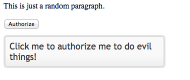

cftooltip
===

The &lt;cftooltip&gt; tag provides the ability to create a tooltip for an HTML item. As an example:

    <cftooltip tooltip="This text explains the stuff below.">
	
This is some text.

	</cftooltip>
	
When the user hovers over the HTML surrounded by the tag, a small box will pop up with the text specified by the tooltip attribute. Other attributes include basic styling options as well as timing controls. Finally, the tag also lets you specify a remote URL to populate the text of the tooltip. 

For this chapter we will make use of the [jQuery UI Tooltip](http://jqueryui.com/tooltip/) library. The jQuery UI library contains multiple different widgets (and is used in multiple examples in this project) but you can, and should, use the minimal required code for the widgets you need. The [download builder](http://jqueryui.com/download/) lets you specify only what you need and we've done that already for the demo files.

Here is a simple example, totally written in simple html. 

**Listing 1 : test1.html**

	<!doctype html>
	<html lang="en">
	<head>
		<meta charset="utf-8">
		<title>Test1</title>
		<link rel="stylesheet" href="lib/css/ui-lightness/jquery-ui-1.10.4.custom.min.css">
		
		
	
		
	
	</head>
	<body>
	 
		

			This is just a random paragraph.
		

	
		

			<button id="doSomething" title="Click me to authorize me to do evil things!">Authorize</button>
		

		
	</body>
	</html>

All jQuery UI templates require one CSS file, jQuery (of course), and the jQueryUI library (and remember, we have an optimized version here just supporting one widget). In our HTML page we have a button we want to add a tooltip to. To activate the tooltip, we use a document.ready block, find the element we want to enhance, and just run tooltip(). With no options jQuery UI will use the title from the DOM item as the text of the tooltip.

todo: ajax example

Alternatives
---

* [qTip](http://craigsworks.com/projects/qtip/) - a jQuery plugin

